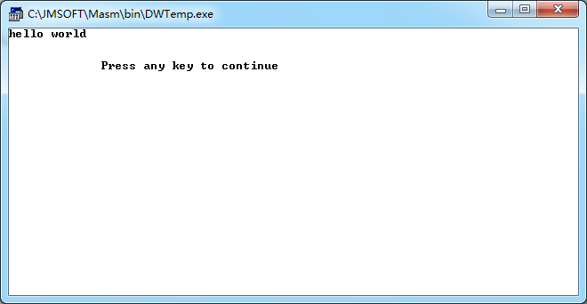
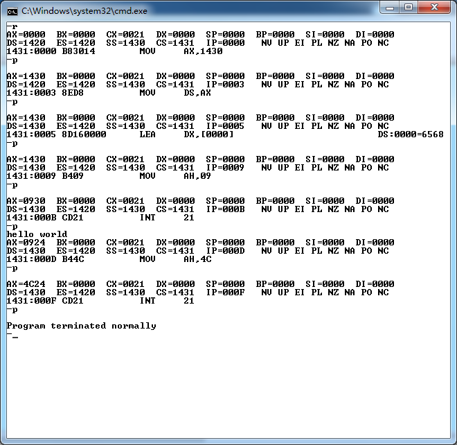

## 一、实验项目 
练习调试工具的使用，记录使用过程。  

## 二、编程环境
* 操作系统：windows7 32位
* 软件：masm for windwos

## 三、调试工具  
debug

## 四、实验源程序
以简单的helloworld为例子
```
DATAS SEGMENT
    a db 'hello world$'
DATAS ENDS
STACKS SEGMENT
    ;此处输入堆栈段代码
STACKS ENDS

CODES SEGMENT
    ASSUME CS:CODES,DS:DATAS,SS:STACKS
START:
    MOV AX,DATAS
    MOV DS,AX
    
    lea dx,a
    mov ah,09h
    int 21h

    MOV AH,4CH
    INT 21H
CODES ENDS
    END START
```
## 五、实验结果  
* 直接运行效果  

* 分步运行效果  


## 六、实验总结  
熟悉了masm的使用和debug的基本命令的使用。对汇编程序的编写有了基本的了解。