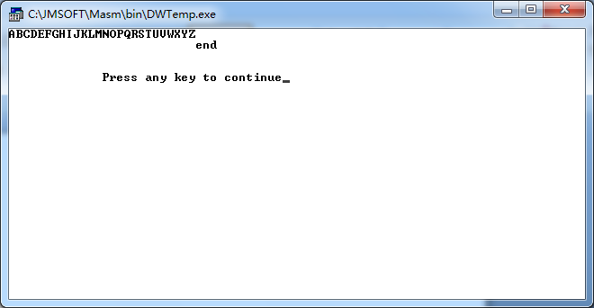

## 一、实验项目 
编程实现一个任务，程序中包含有三类流程控制语句的程序段。  

## 二、编程环境 
* 操作系统：windows7 32位
* 软件：masm for windows

## 三、任务的输出结果  


## 四、实验源程序  
使用三类流程控制来输出26个大写字母。  
```
DATAS SEGMENT
    a db 0ah,'end$'
DATAS ENDS

STACKS SEGMENT
    ;此处输入堆栈段代码
STACKS ENDS

CODES SEGMENT
    ASSUME CS:CODES,DS:DATAS,SS:STACKS
START:
    MOV AX,DATAS
    MOV DS,AX
    
    ;流程控制loop循环输出大写字母
    mov dl,40h
    mov cx,100
s1: add dl,1
    ;当超出大写字母的范围时就退出
    cmp dl,5ah
    jg s2
    mov ah,02h
    int 21h
    loop s1
    
s2: lea dx,a
    mov ah,09h
    int 21h
    jmp s3
    
s3: MOV AH,4CH
    INT 21H
    
CODES ENDS
    END START
```
## 五、体会  
对流程控制有了更好的了解，更好的掌握了流程控制语句。