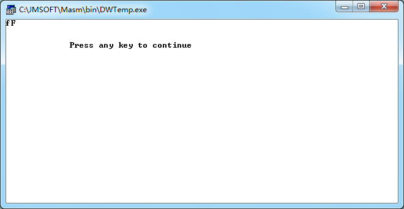

## 一、实验项目 
编程实现一个任务，任务可分为多个子程序来实现。  

## 二、编程环境 
* 操作系统：windows7 32位
* 软件：masm for windows

## 三、任务的输出结果  
*  小写转大写  

* 大写转小写  


## 四、实验源程序
大小写转换的子程序  
```
DATAS SEGMENT
    ;此处输入数据段代码
DATAS ENDS

STACKS SEGMENT
    ;此处输入堆栈段代码
STACKS ENDS

CODES SEGMENT
    ASSUME CS:CODES,DS:DATAS,SS:STACKS
START:
    ;输入一个字母
    mov ah,01h
    int 21h
    mov bl,al
    ;调用子程序
    call func
    ;输出
    mov ah,02h
    int 21h
    
    MOV AH,4CH
    INT 21H
func proc near
    cmp bl,60h
    jl l1
    jg l2
l1: add bl,20h;大写转小写
    jmp l3
l2: sub bl,20h;小写转大写
    jmp l3
l3: mov dl,bl
    ret
func endp
    
CODES ENDS
    END START
```
## 五、体会  
更好的理解了子程序的调用和子程序的传递参数。
