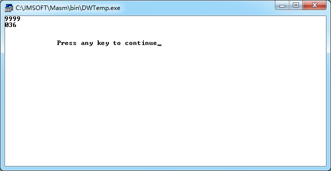
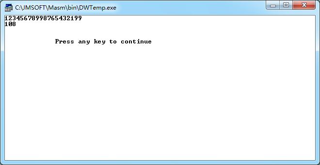
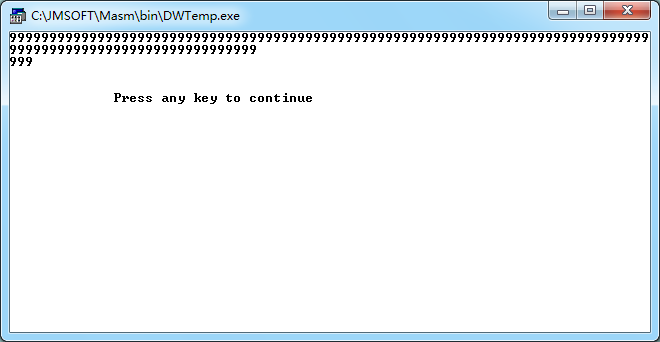

## 一、实验项目 
编程实现一个十进制数据处理任务。  

## 二、编程环境 
* 操作系统：windows7 32位
* 软件：masm for windows

## 三、调试数据与结果  




## 四、实验源程序  
实现一串一位数的相加，最大和为999
```
DATAS SEGMENT
    ;此处输入数据段代码
DATAS ENDS

STACKS SEGMENT
    ;此处输入堆栈段代码
STACKS ENDS

CODES SEGMENT
    ASSUME CS:CODES,DS:DATAS,SS:STACKS
START:
    ;清零
    xor ax,ax
    xor bx,bx
    xor cx,cx
    ;输入一串一位数
input:mov ah,01h
    int 21h
    cmp al,0dh;输入为回车时结束输入
    je sum
    sub al,30h
    mov cl,al
    mov ax,bx
    add ax,cx
    daa
    adc ah,0
    mov bx,ax
    jmp input
    
sum:;先输出一个换行
    mov dl,0ah
    mov ah,02h
    int 21h
    ;输出百位
    mov ax,bx
    and ax,0f00h
    mov dl,ah
    add dl,30h
    mov ah,02h
    int 21h
    ;输出十位
    mov ax,bx
    and ax,00f0h
    mov cl,4
    shr ax,cl
    mov dl,al
    add dl,30h
    mov ah,02h
    int 21h
    ;输出个位
    mov ax,bx
    and ax,000fh
    mov dl,al
    add dl,30h
    mov ah,02h
    int 21h

    MOV AH,4CH
    INT 21H
CODES ENDS
    END START
```

## 五、体会
更好地掌握了加法指令，提高了程序的编写能力。