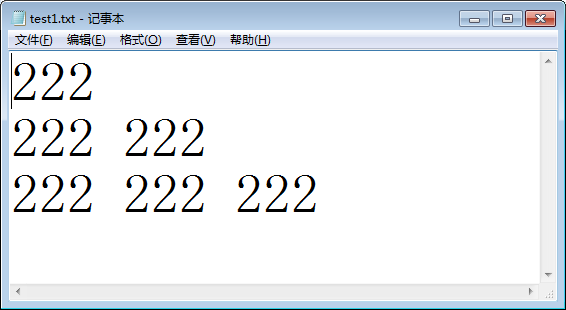

## 一、实验项目  
编程实现三个以上相互关联的数据文件中内容的关联性处理。

## 二、编程环境 
* 操作系统：windows7 32位
* 软件：masm for windows

## 三、调试数据与结果  
* 运行程序之前，操作目录下的情况  

* 运行程序前，文件中的内容  



* 运行程序输出test.txt的内容和b(来自与test1.txt)中的内容 

* 运行程序之后，test2.txt中的内容  

* 运行程序之后，文件夹中的情况  


## 四、实验源程序  
```
DATAS SEGMENT
    ;此处输入数据段代码
    path db 'd:/ass_test/test.txt',0
    path1 db 'd:/ass_test/test1.txt',0
    path2 db 'd:/ass_test/test2.txt',0
    a db 100 dup (?),'$'
    b db 100 dup (?),'$'
DATAS ENDS

STACKS SEGMENT
    ;此处输入堆栈段代码
STACKS ENDS

CODES SEGMENT
    ASSUME CS:CODES,DS:DATAS,SS:STACKS
START:
    ;读test.txt并将其中的内容输出到屏幕上
    MOV AX,DATAS
    MOV DS,AX
    ;打开文件TEST.TXT
    lea dx,path
    mov al,00h;用读模式打开文件
    mov ah,3dh
    int 21h
    ;读取文件内容，存入a
    lea dx,a

    mov bx,ax;将文件代号传给bx
    mov cx,100;暂定读入100个字节
    mov ah,3fh
    int 21h

    ;显示a中的内容
    mov cx,ax;保存实际读入的字节数，用于打印时的循环
    lea si,a
print:
    mov dl,[si]
    mov ah,02h
    int 21h
    inc si
    loop print
    ;关闭文件
    mov ah,3eh
    int 21h

read_file1:
    lea dx,path1
    mov al,00h
    mov ah,3dh
    int 21h
    ;把test1中的内容存到b中
    lea dx,b
    mov bx,ax
    mov cx,100
    mov ah,3fh
    int 21h
    ;输出b中的内容
    lea dx,b
    mov ah,09h
    int 21h
    ;关闭文件
    mov ah,3eh
    int 21h

write_file2:
    ;将b中的内容写入到test2.txt中
    lea dx,path2
    mov al,01h
    mov ah,3dh
    int 21H

    lea dx,b
    mov bx,ax

    mov cx,100
    mov ah,40h
    int 21h

    mov ah,3eh
    int 21h

delete_file1:
    ;删除test1.txt
    lea dx,path1
    mov ah,41h
    int 21h

    MOV AH,4CH  ;程序结束，返回到操作系统系统
    INT 21H
CODES ENDS
END START
```

## 五、体会  
学会了如何进行简单的文件操作，读、写、删除，编程能力得到提高。  
更好地掌握了系统功能的调用。