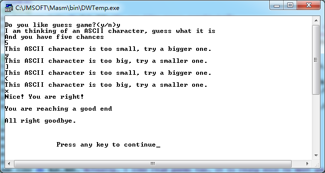
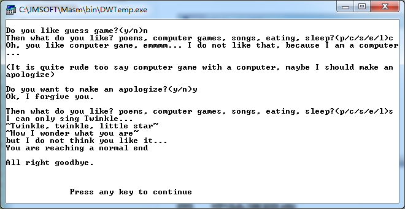
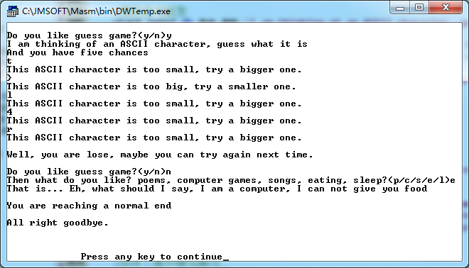
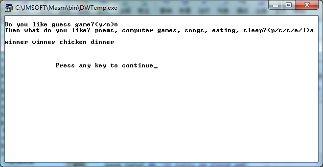

## 一、实验项目  
开发一个总源代码行数不低于300行（或新代码行数不少于200行）的汇编语言程序以解决一个相对独立的局部应用问题。 

## 二、编程环境 
* 操作系统：windows7 32位
* 软件：masm for windows

## 三、调试数据与结果  






## 四、实验源程序  
编写了一个简单的游戏，包含猜数游戏，简单交互和分支结果
```
DATAS SEGMENT
    ;询问用语
    ask_for_game_info db 0ah,'Do you like guess game?(y/n)$'
    error_info db 0ah,'Sorry, I can not understand what you are saying... Tell me again please.(y/n)$'
    ask_others_info db 0ah,'Then what do you like? poems, computer games, songs, eating, sleep?(p/c/s/e/l)$'
    like_nothing_info db 0ah,'It seems that you like nothing, I will just leave',0ah,'$'

    ;猜数游戏触发
    start_info1 db 0ah,'I am thinking of an ASCII character, guess what it is',0ah,'$'
    start_info2 db 'And you have five chances',0ah,'$'
    too_small_info db 0ah,'This ASCII character is too small, try a bigger one.',0ah,'$'
    too_big_info db 0ah,'This ASCII character is too big, try a smaller one.',0ah,'$'
    win_info db 0ah,'Nice! You are right!',0ah,'$'
    lose_info db 0ah,'Well, you are lose, maybe you can try again next time.',0ah,'$'

    ;读诗歌触发
    poem_title_info db 0ah,'Rain',0ah,'$'
    poem_info1 db 'Rain is falling all around,',0ah,'$'
    poem_info2 db 'It falls on field and tree,',0ah,'$'
    poem_info3 db 'It rains on the umbrella here,',0ah,'$'
    poem_info4 db 'And on the ships at sea.',0ah,'$'
    same_like db 0ah,'Actually, I like read poems too, it is realy nice to meet you!',0ah,'$'

    ;选择了喜欢电脑游戏触发
    deny_computer_info db 0ah,'Oh, you like computer game, emmmm... I do not like that, because I am a computer...',0ah,'$'
    someone_is_saying db 0ah,'(It is quite rude too say computer game with a computer, maybe I should make an apologize)',0ah,'$'
    apologize_info db 0ah,'Do you want to make an apologize?(y/n)$'
    be_forgived_info db 0ah,'Ok, I forgive you.',0ah,'$'

    ;选择了喜欢睡觉触发
    tired_info db 0ah,'It seems you are really tired, you should just go to sleep, have a good dream!',0ah,'$'

    ;选择了喜欢唱歌触发
    songs_title_info db 0ah,'I can only sing Twinkle...',0ah,'$'
    songs_info db '~Twinkle, twinkle, little star~',0ah,'~How I wonder what you are~',0ah,'$'
    songs_end_info db 'but I do not think you like it...$'

    ;选择了喜欢吃东西触发
    eating_info db 0ah,'That is... Eh, what should I say, I am a computer, I can not give you food',0ah,'$'

    ;用户到达了普通结局
    normal_info db 0ah,'You are reaching a normal end',0ah,'$'
    ;用户到达了好结局
    good_info db 0ah,'You are reaching a good end',0ah,'$'
    ;用户到达了坏结局
    bad_info db 0ah,'You are reaching a bad end',0ah,'$'
    ;用户到达了隐藏结局
    ;以下ascii码表示‘winner winner checkin dinner’
    hiding_info db 0ah,0ah,77h,69h,6eh,6eh,65h,72h,20h,77h,69h,6eh,6eh,65h,72h,20h,63h,68h,69h,63h,6bh,65h,6eh,20h,64h,69h,6eh,6eh,65h,72h,0ah,'$'

    ;退出程序时触发
    goodbye_info db 0ah,'All right goodbye.',0ah,'$'
DATAS ENDS

STACKS SEGMENT
    ;此处输入堆栈段代码
STACKS ENDS

CODES SEGMENT
    ASSUME CS:CODES,DS:DATAS,SS:STACKS
START:
    MOV AX,DATAS
    MOV DS,AX
    
ask_for_game:
    ;询问是否要玩猜数游戏
    lea dx,ask_for_game_info
    mov ah,09h
    int 21h
    
    ;输入一个字符
    mov ah,01h
    int 21h
    ;判断输入是y时开始游戏
    cmp al,'y'
    je game_start
    ;判断输入是n时询问其他的爱好
    cmp al,'n'
    je ask_others
    ;输入既不是y也不是n时，提示错误，并且再次开始询问是否要玩猜数游戏
    lea dx,error_info
    mov ah,09h
    int 21h
    jmp ask_for_game

ask_others:
    ;问点别的
    lea dx,ask_others_info
    mov ah,09h
    int 21h

    mov ah,01h
    int 21h
    ;输入为p时，表示喜欢诗歌，跳转到诗歌段
    cmp al,'p'
    je read_poem
    ;输入为c时，表示喜欢电脑游戏，跳转到电脑游戏段
    cmp al,'c'
    je computer_game
    ;输入为s时，表示喜欢听歌，跳转到唱歌
    cmp al,'s'
    je sing_songs
    ;输入为e时，表示喜欢吃
    cmp al,'e'
    je eating
    ;输入为l时，表示喜欢睡觉，跳转到睡觉段
    cmp al,'l'
    je sleep
    ;输入为a时，进入隐藏结局
    cmp al,'a'
    je hiding_end
    ;输入不在上述情况，表示没有共同爱好，直接退出
    lea dx,like_nothing_info
    mov ah,09h
    int 21h
    jmp bad_end


game_start:
    ;输出游戏开始信息
    ;设置一个用来猜的字符
    mov bl,'x'
    ;设定可以猜的次数
    mov cx,5
    lea dx,start_info1
    mov ah,09h
    int 21h
    lea dx,start_info2
    mov ah,09h
    int 21h
    jmp input

input:
    ;输入并且判断输入的字符和设定的字符是否相等
    mov ah,01h
    int 21h
    cmp al,bl
    jl too_small
    jg too_big
    je win

too_small:
    ;猜的字符ascii码太小了，输出提示语
    lea dx,too_small_info
    mov ah,09h
    int 21h
    jmp end_of_judge

too_big:
    ;猜的字符ascii码太大了，输出提示语
    lea dx,too_big_info
    mov ah,09h
    int 21h
    jmp end_of_judge

end_of_judge:
    ;五次机会用完了，输了
    loop input
    jmp lose

win:
    ;五次机会之内猜出了这个字符，获胜
    lea dx,win_info
    mov ah,09h
    int 21h
    jmp good_end

lose:
    ;输了，是否再来一局
    lea dx,lose_info
    mov ah,09h
    int 21h
    jmp ask_for_game

read_poem:
    ;用户选择喜欢诗歌，那就读首诗歌
    lea dx,poem_title_info
    mov ah,09h
    int 21h
    lea dx,poem_info1
    mov ah,09h
    int 21h
    lea dx,poem_info2
    mov ah,09h
    int 21h
    lea dx,poem_info3
    mov ah,09h
    int 21h
    lea dx,poem_info4
    mov ah,09h
    int 21h

    lea dx,same_like
    mov ah,09h
    int 21h
    jmp good_end
    
sing_songs:
    ;用户选择喜欢听歌，那就唱首歌
    lea dx,songs_title_info
    mov ah,09h
    int 21h
    lea dx,songs_info
    mov ah,09h
    int 21h
    lea dx,songs_end_info
    mov ah,09h
    int 21h
    jmp normal_end

computer_game:
    ;选择了喜欢玩电脑游戏
    ;电脑不开心了
    lea dx,deny_computer_info
    mov ah,09h
    int 21h
    ;提示用户可以像电脑道歉
    lea dx,someone_is_saying
    mov ah,09h
    int 21h
    ;询问是否道歉
    lea dx,apologize_info
    mov ah,09h
    int 21h
judge:
    ;输入是否道歉
    mov ah,01h
    int 21h
    ;道歉，则电脑重新询问爱好
    cmp al,'y'
    je forgive
    ;不道歉，则退出程序
    cmp al,'n'
    je bad_end
    ;输入既不是y也不是n，请求重新输入
    lea dx,error_info
    mov ah,09h
    int 21h
    jmp judge

forgive:
    ;电脑原谅了用户的行为
    lea dx,be_forgived_info
    mov ah,09h
    int 21h
    ;重新询问爱好
    jmp ask_others

sleep:
    ;用户选择了喜欢睡觉
    ;向用户道晚安并退出程序
    lea dx,tired_info
    mov ah,09h
    int 21h
    jmp normal_end

eating:
    ;用户选择了喜欢吃东西
    lea dx,eating_info
    mov ah,09h
    int 21h
    jmp normal_end

normal_end:
    ;普通结局
    lea dx,normal_info
    mov ah,09h
    int 21h
    jmp exit

bad_end:
    ;坏结局
    lea dx,bad_info
    mov ah,09h
    int 21h
    jmp exit

good_end:
    ;好结局
    lea dx,good_info
    mov ah,09h
    int 21h
    jmp exit

hiding_end:
    ;隐藏结局
    lea dx,hiding_info
    mov ah,09h
    int 21h
    mov ah,4ch
    int 21h

exit:
    ;退出程序，再见
    lea dx,goodbye_info
    mov ah,09h
    int 21h
    MOV AH,4CH
    INT 21h
    
CODES ENDS
    END START

```
## 五、体会  
更好地掌握了汇编语言的编写，对汇编语言的运行过程和dos系统功能的调用有了更好的理解
