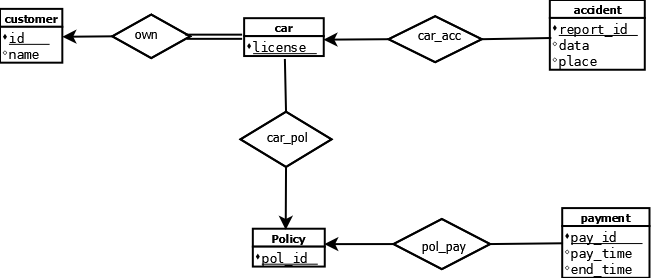

## 第七章习题

### 7.1  
为车辆保险公司构建一个E-R图，它的每个客户有有一辆或多辆车。每辆车关联零次或任意多次事故的记录。每张保险单为一辆或多辆车保险，并于一个或多个保费支付相关联。每次支付只针对特定的一段时间，具有关联的到期日和缴费日。  

### 7.2
考虑一个用于记录学生在不同开课（section）的不同考试中所得成绩的数据库。  
* 为数据库构造一个E-R图，其中，将考试建模为实体并使用一个三元联系。

* 构造另一个E-R图，其中，只用students和section间的二元联系。保证在特定student和section对之间只存在一个联系；而且你可以表示出学生在不同考试中所得成绩。  

### 7.3  
设计一个E-R图用于跟踪记录你最喜欢的球队的成绩。你应该保存打过的比赛，每场比赛的比分，每场比赛的上场队员以及每个队员在每场比赛中的统计数据。总的统计数据应该被建模成派生属性。  

### 7.14  
解释主码、候选码和超码这些术语之间的区别。
> 超码：一个或多个属性的集合，这些属性的组合可以使我们在一个关系中唯一地标识一个元组。  
> 候选码：最小的超码。  
> 主码：代表被设计者选中，主要用来在一个关系中区分不同元组的候选码。  

### 7.15  
为医院构建一个包含一组病人和一组医生的E-R图。为每个病人关联一组不同的检查和化验记录。  

### 7.16  
为实践习题7.1~7.3中的每个E-R图构建适当的关系模式。  
（加粗代替下划线）  
* 7.1  
> customer(**id**, name)
> 
> car(**license**)
> 
> own(id, **license**)
> 
> accident(**report_id**, data, place)
> 
> car_acc(**report_id**, **license**)
> 
> Policy(**pol_id**)
> 
> car_pol(**license**, **pol_id**)
> 
> payment(**pay_id**, pay_time, end_time)
> 
> pol_pay(**pol_id**, **pay_id**)

* 7.2(1)  
> Student(**ID**, name)
> 
> section(**sec_id**)
> 
> exam(**exam_id**, marks)
> 
> exam_marks(**ID**, **sec_id**, **exam_id**)
> 

* 7.2(2)
> Student(**ID**, name)
> 
> section(**sec_id**)
> 
> exam_marks(**ID**, **sec_id**, **exam_id**, marks)
> 

* 7.3  
> competition(**com_id**, team_id, team_name, self_score, other_score)
> 
> team(**team_id**, team_name)
> 
> player(**player_id**, name, score)  

### 7.17  
扩展时间习题7.3中的E-R图，以追踪整个联赛中所有队伍的信息。  

### 7.20  
考虑图7-29中的E-R图，它对一家网上书店建模。  
a. 列出实体集及其主码。  
> （加粗代替下划线）  
> 
> author(**name**, address, URL)  
> 
> book(**ISBN**, title, year, price)  
> 
> publisher(**name**, address, phone, URL)  
> 
> shopping_basket(basket_id)  
> 
> warehouse(**code**, address, phone)  
> 
> customer(**email**, name, address, phone)  

b. 假设...扩展E-R图。  

c. 用概化扩展E-R图。  

### 7.21  
为一个汽车公司设计一个数据库，用于协助它的经销商维护客户记录以及经销商库存，并协助销售人员订购车辆。  
  
> (加粗代表下划线)  
> brand(**brand_id**, brand_name)  
> 
> model(**model**, model_name)  
> 
> b_m(**model_id**, brand_name  
> 
> &emsp;&emsp;foreign key brand_name references brand,  
> 
> &emsp;&emsp;foreign key model_id references model)  
> 
> option(**opt_id**, opt_info)  
> 
> opt(**opt_id**,  model_id
> 
> &emsp;&emsp;foreign key opt_id references option,  
> 
> &emsp;&emsp;foreign key model_id references model)  
> 
> vehichle(**VIN**)  
> 
> m_V(**VIN**, model-id  
> 
> &emsp;&emsp;foreign key VIN references vehicle,  
> 
> &emsp;&emsp;foreign key model_id references model)  
> 
> distributor(**distributor_id**, distributor_name)
> 
> sell(**VIN**, distributor_id
> 
> &emsp;&emsp;foreign key VIN references vehicle,
> 
> &emsp;&emsp;foreign key distributor_id references distributor)
> 
> customer(**customer_id**, customer_name)
> 
> buy(**VIN**, customer_id
> 
> &emsp;&emsp;foreign key VIN references vehicle,
> 
> &emsp;&emsp;foreign key customer_id references customer)

### 7.22  
为全球性的快递公司（例如DHL或者FedEX）设计一个数据库。  
  
> (加粗代表下划线)  
> customer(**customer_id**, customer_name, customer_address, phone_number)  
> package(**package_id**, sender_id, receiver_id  
> &emsp;&emsp;foreign key sender_id references customer(customer_id),    
> &emsp;&emsp;foreign key receiver_id references customer(customer_id))  
> send(**package_id**, sender_id  
> &emsp;&emsp;foreign key sender_id references customer(customer_id),    
> &emsp;&emsp;foreign key package_id references package)  
> recevie(**package_id**, recevier_id,  
> &emsp;&emsp;foreign key recevier_id references customer(customer_id),    
> &emsp;&emsp;foreign key package_id references package)  
> location(**place_id**, truck_id, airplane_id, airport_id, warehouse_id)  
> history_location(**package_id**, **place_id**,  
> &emsp;&emsp;foreign key place_id references location,    
> &emsp;&emsp;foreign key package_id references package)  

### 7.23  
为航空公司设计一个数据库。  
  
> customer(**id**, name)  
> flight(**flight_number**, from_station, to_station, start_time, end_time)  
> status(**id**, **flight_number**, status, seat_number  
> &emsp;&emsp;foreign key id references customer,    
> &emsp;&emsp;foreign key flight_number references flight)  
> book(**id**, **flight_number**, book_time,  
> &emsp;&emsp;foreign key id references customer,    
> &emsp;&emsp;foreign key flight_number references flight)  
> future(**id**, **flight_number**, book_time,  
> &emsp;&emsp;foreign key id references customer,    
> &emsp;&emsp;foreign key flight_number references flight)  

### 7.26  
为机动车辆销售公司设计一个概化——特化层次结构。  
  
> 分为公用车和私用车，共用车中在分为货运车和客运车  
> 