## 实验一报告  

### 实验目的  
1. 掌握建立本地Net服务名(TNS)的方法；  
2. 熟悉和掌握使用 SQL Plus工具操作数据库；  
3. 熟悉 TOAD 工具。  

### 实验内容  
1. 使用 Oracle 的 TNS配置程序建立本地服务名；  
a.运行 Oracle的 TNS配置程序；（程序里面的 oracle目录下的 Net Configuration Assistant）  
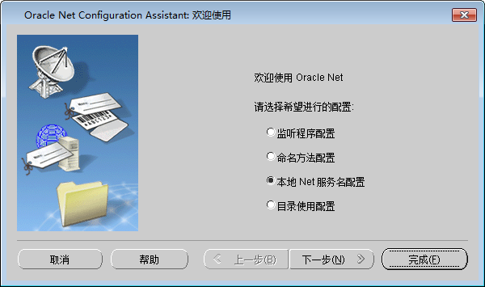  
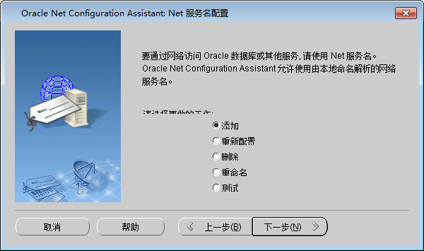  
b.输入远程数据库服务名——orcl；  
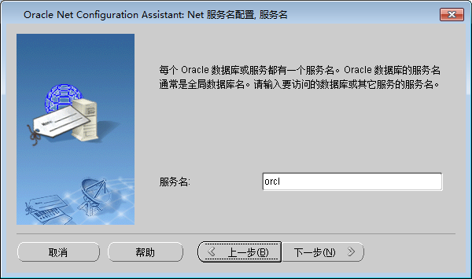  
c.输入远程数据库 IP地址（172.22.11.8）和端口（1521）；  
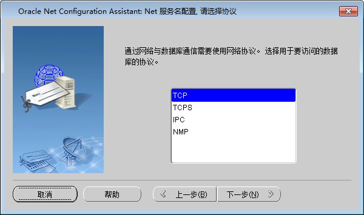  
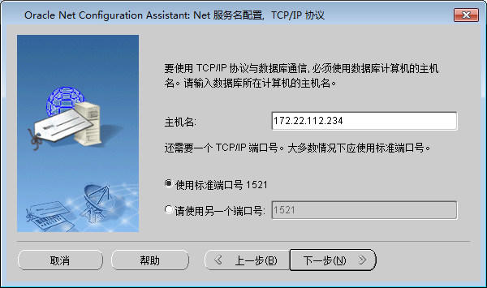  
d. 使用自己的姓名作为帐户和学号作为密码测试；  
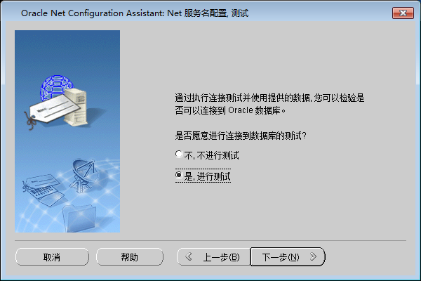  
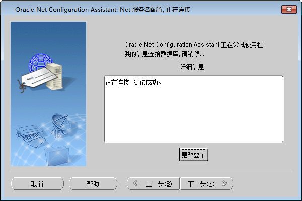  
e.输入一个自己容易记住的名字命名 TNS，如 orcl之类的。  
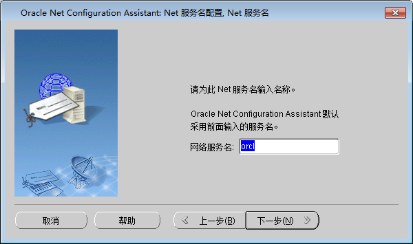  
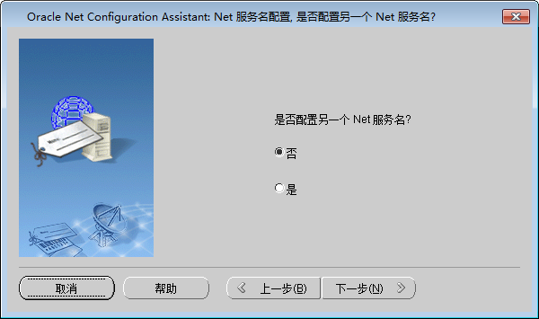  
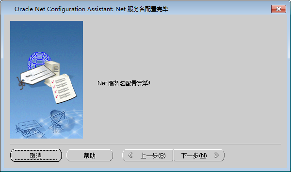  
f.完成配置。  
2. 使用 SQL Plus 工具登陆远程数据库；  
a.运行 Oracle的 SQL Plus工具；  
b. 使用自己的学号作为帐户和密码，主机字符串为刚才自己配置的 TNS登陆；  
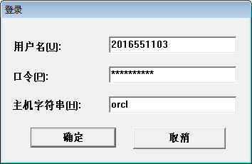
c.记录程序信息；  
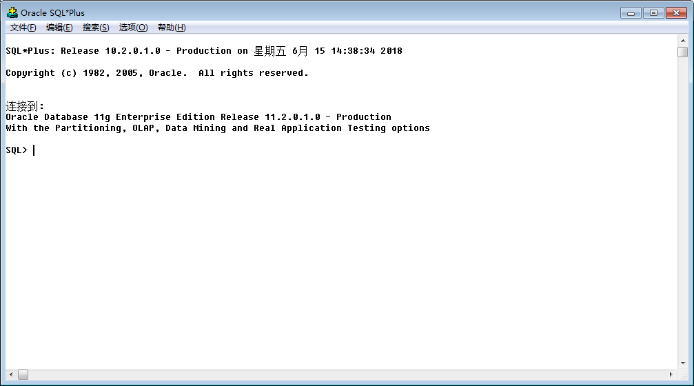
d.键入“create table taba(cola int,colb int);”，记录 SQL语句运行结果；  
e.键入“insert into taba values(1,1);”，记录 SQL语句运行结果；  
f.键入“commit；”，提交插入操作；  
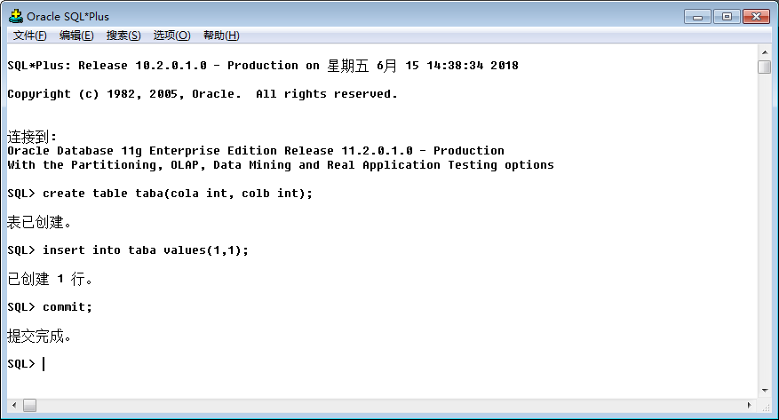
g.退出应用程序。  
3. 在命令行下使用 SQL Plus登陆远程数据库；  
a.点击运行菜单（或者按 Win+R键）；  
b.输入 cmd；  
c.在命令行窗口下输入 sqlplus 用户名/密码@TNS,如 sqlplus scott/tiger@orcl；  
d.记录程序信息；  
e.键入“select * from taba;”，记录 SQL语句运行结果；  
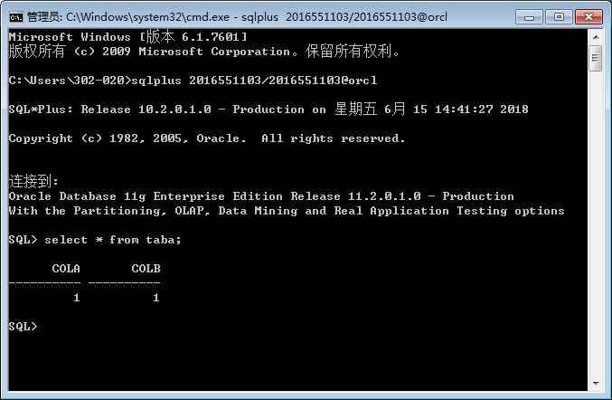
f.退出程序。  
4. 使用 TOAD工具登陆远程数据库。(实验室的TOAD软件没有激活liscense，实验实际使用Oracle SQL Developer工具，并使用直接连接)  
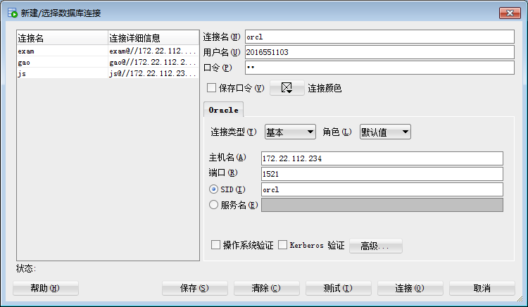
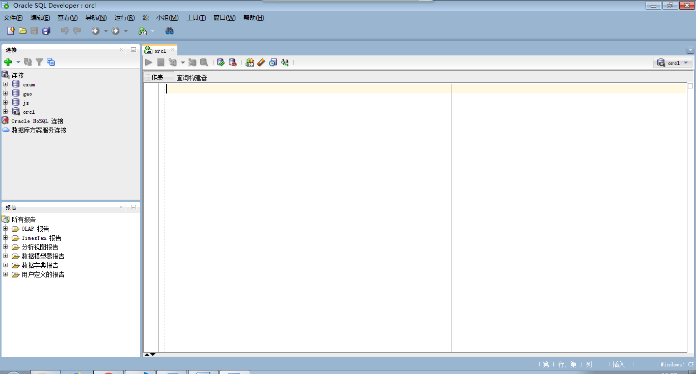
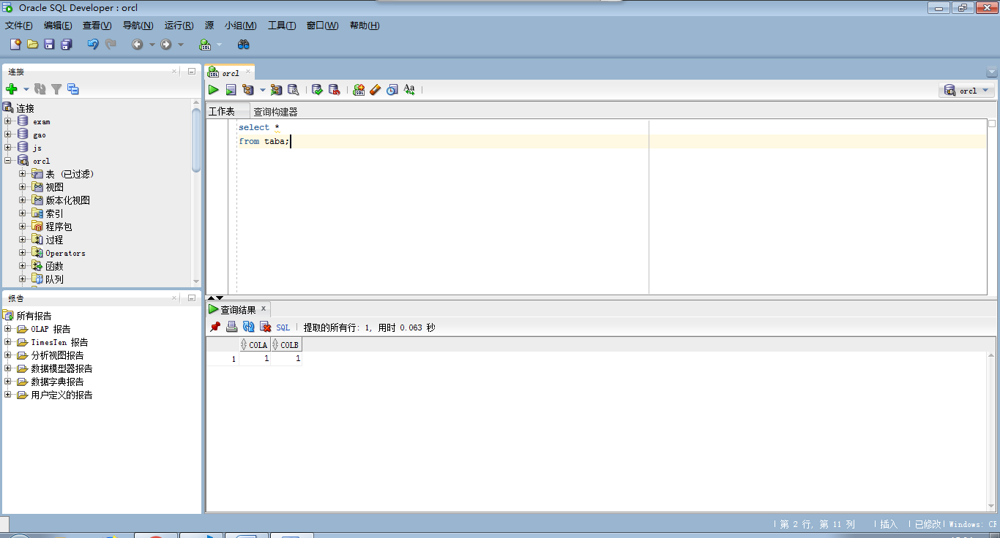

### 比较三种不同方式使用数据库的不同  
前两种方法类似，都使用了命令的形式，第三种有图形界面。