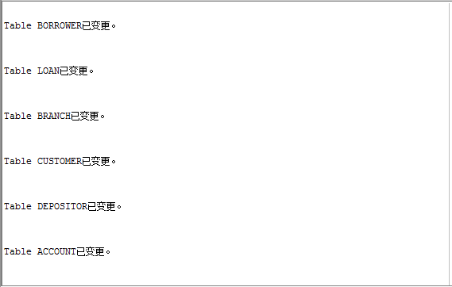
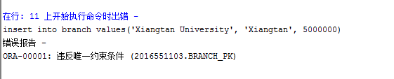
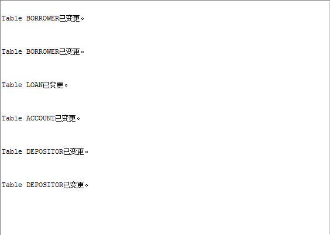
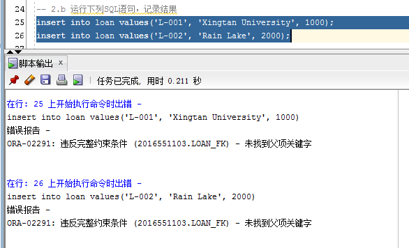
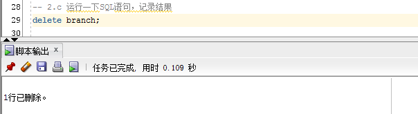
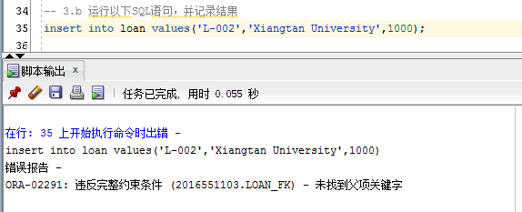
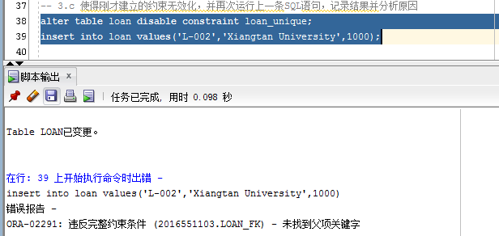
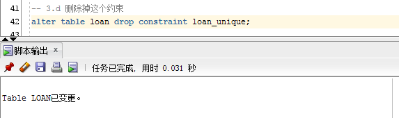
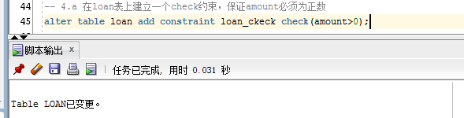
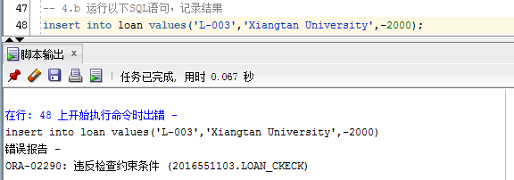

## 实验三（完整性约束）报告  

### 实验目的  
1. 熟悉主键，外键，check等完整性约束；  
2. 掌握完整性约束的建立，删除，有效化和无效化；熟悉相关的DDL命令。  
3. 学会看数据库模型图。  

### 实验内容  
1. 主键约束  

a. 建立所有表的主键约束  
```sql
alter table borrower add constraint borrower_pk primary key(customer_name, loan_number);
alter table loan add constraint loan_pk primary key (loan_number);
alter table branch add constraint branch_pk primary key (branch_name);
alter table customer add constraint customer_pk primary key (customer_name);
alter table depositor add constraint depositor_pk primary key (customer_name, account_number);
alter table account add constraint account_pk primary key (account_number);
```  
  

b．运行下列SQL语句：  
```sql
insert into branch values(‘Xiangtan University’,’Xiangtan’,4000000);  
insert into branch values(‘Xiangtan University’,’Xiangtan’,5000000);  
```
记录结果并分析原因。  
  
> 原因：branch_name 是主键，违反了主键的约束条件  

2. 外键约束

a. 按照图1所示，建立所有的外键约束。  

b. 运行以下的两条SQL语句：  
```sql
insert into loan values(‘L-001’,’Xiangtan University’,1000);
insert into loan values(‘L-002’,’Rain Lake’,2000);
```
记录结果并分析原因。 
  
> loan表的branch_name是外键，参照branch表，但是此时插入的‘Xiangtan University’项在branch表中并没有出现  
> 第二条语句同理  

c． 运行以下的SQL语句：  
```sql
delete branch;
```
记录结果并分析原因。  
  

3. unique约束  

a. 在loan表上建立一个unique约束，保证amount是唯一的。  
```sql
alter table loan add constraint loan_unique unique(amount);
```
b. 运行以下SQL语句：  
```sql
insert into loan values(‘L-002’,’Xiangtan University’,1000);
```
记录结果并分析原因。  
  
> 在2.c中删除了branch表中的内容，使得的插入项违反了外键约束

c. 使得刚才建立的约束无效化，并再次运行上一条SQL语句，记录结果并分析原因。  
```sql
alter table loan disable constraint loan_unique;
insert into loan values('L-002','Xiangtan University',1000);
```
  
> 同2.b理

d. 删除掉这个约束。  
```sql
alter table loan drop constraint loan_unique;
```

4. check约束  

a. 在loan表上建立一个check约束，保证amount必须为正数。  
```sql
alter table loan add constraint loan_ckeck check(amount>0);
```

b. 运行以下SQL语句：
```sql
insert into loan values(‘L-003’,’Xiangtan University’,-2000);
```
记录结果并分析原因。  
  
> 违反了amount>0的check约束条件  

### 主键，外键的含义及区别  
主键：在一个关系中区分不同元组的的候选键  
外键：一个关系模式中的属性参照了另一个关系模式，这个属性成为外键  

### unqiue 约束与主键的关系和区别  
unqiue： 可空，可以在一个表里的一个或多个字段定义；  
主键： 不可空不可重复，在一个表里可以定义联合主键；

### check 约束使用的限制  
如果对单个列定义 CHECK 约束，那么该列只允许特定的值。  
如果对一个表定义 CHECK 约束，那么此约束会基于行中其他列的值在特定的列中对值进行限制。  