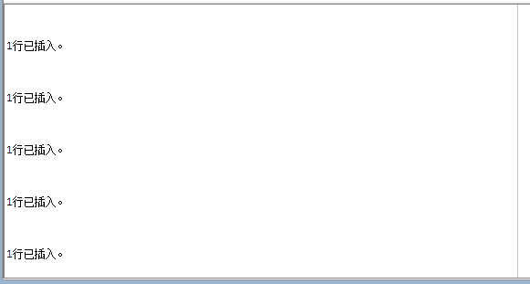
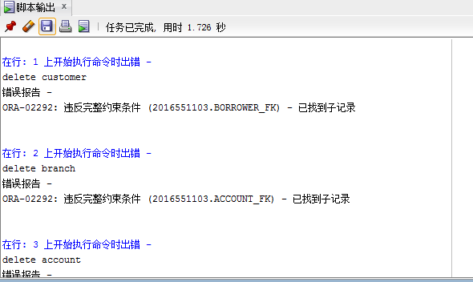

## 实验四（插入）报告

### 实验目的  
1. 熟练掌握 insert语句的使用；
2. 体会外键对于数据插入顺序的影响；
3. 掌握脚本运行的方法。

### 预备知识  
1. PL/SQL中的insert语句
2. TOAD的使用

### 实验内容

1. 请在对应表中插入数据
```sql
delete customer;
delete branch;
delete account;
delete depositor;
delete loan;
delete borrower;

insert into branch values('Downtown','Brooklyn',900000);
insert into branch values('Redwood','Palo Alto',2100000);
insert into branch values('Perryridge','Horseneck',1700000);
insert into branch values('Mianus','Horseneck',400200);
insert into branch values('Round Hill','Horseneck',8000000);
insert into branch values('Pownal','Bennington',400000);
insert into branch values('North Town','Rye',3700000);
insert into branch values('Brighton','Brooklyn',7000000);
insert into branch values('Central','Rye',400280);

insert into customer values('Jones','Main','Harrison');
insert into customer values('Smith','Main','Rye');
insert into customer values('Hayes','Main','Harrison');
insert into customer values('Curry','North','Rye');
insert into customer values('Lindsay','Park','Pittsfield');
insert into customer values('Turner','Putnam','Stamford');
insert into customer values('Williams','Nassau','Princeton');
insert into customer values('Adams','Spring','Pittsfield');
insert into customer values('Johnson','Alma','Palo Alto');
insert into customer values('Glenn','Sand Hill','Woodside');
insert into customer values('Brooks','Senator','Brooklyn');
insert into customer values('Green','Walnut','Stamford');
insert into customer values('Jackson','University','Salt Lake');
insert into customer values('Majeris','First','Rye');
insert into customer values('McBride','Safety','Rye');

insert into account values('A-101','Downtown',500);
insert into account values('A-215','Mianus',700);
insert into account values('A-102','Perryridge',400);
insert into account values('A-305','Round Hill',350);
insert into account values('A-201','Perryridge',900);
insert into account values('A-222','Redwood',700);
insert into account values('A-217','Brighton',750);
insert into account values('A-333','Central',850);
insert into account values('A-444','North Town',625);

insert into depositor values('Hayes','A-101');
insert into depositor values('Hayes','A-102');
insert into depositor values('Johnson','A-101');
insert into depositor values('Johnson','A-201');
insert into depositor values('Jones','A-217');
insert into depositor values('Lindsay','A-222');
insert into depositor values('Majeris','A-333');
insert into depositor values('Smith','A-215');
insert into depositor values('Smith','A-444');
insert into depositor values('Turner','A-305');

insert into loan values('L-17','Downtown',1000);
insert into loan values('L-23','Redwood',2000);
insert into loan values('L-15','Perryridge',1500);
insert into loan values('L-14','Downtown',1500);
insert into loan values('L-93','Mianus',500);
insert into loan values('L-11','Round Hill',900);
insert into loan values('L-16','Perryridge',1300);
insert into loan values('L-20','North Town',7500);
insert into loan values('L-21','Central',570);

insert into borrower values('Adams','L-16');
insert into borrower values('Curry','L-93');
insert into borrower values('Hayes','L-15');
insert into borrower values('Jackson','L-14');
insert into borrower values('Jones','L-17');
insert into borrower values('McBride','L-20');
insert into borrower values('Smith','L-11');
insert into borrower values('Smith','L-21');
insert into borrower values('Smith','L-23');
insert into borrower values('Williams','L-17');
```

2. 如果插入顺序不同，比如按以上表的相反的顺序插入记录到各个表中，会有什么结果。


3. 保留下所有的插入操作脚本。在脚本前加入以下的语句：
```sql
delete customer;
delete branch;
delete account;
delete depositor;
delete loan;
delete borrower;
```
使用脚本执行运行整个脚本。  

### 外键对于插入数据顺序的影响  
要求插入时应当先插入被参照关系，再插入参照关系
