## 实验五（查询与视图）报告

### 实验目的  
1. 掌握 select 的基本使用。
2. 集合运算的语法。
3. 掌握建立视图的语法。
4. 掌握和理解外部连接的使用。
5. 掌握通过 select 方式建表和插入数据的方法。

### 预备知识  
1. select 语句的基本语法
2. create view 的语法
3. 外部链接的含义及语法

### 实验内容  
1. 查询所有顾客的姓名。
```sql
select customer_name
from customer;
```
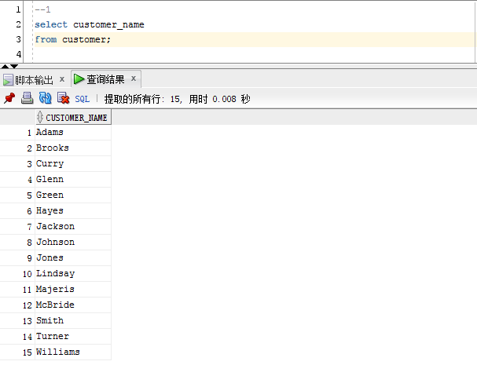

2. 查询所有分行的信息。
```sql
select *
from branch;
```
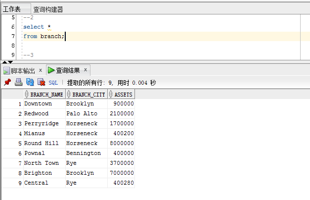

3. 查询所有存款人的姓名。
```sql
select customer_name
from depositor;
```
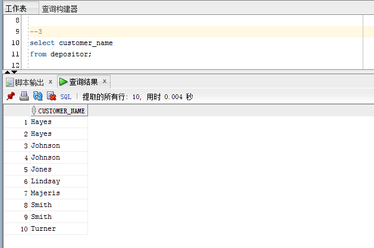

4. 查询所有存款额大于 1200 元的存款信息。
```sql
select *
from account
where balance > 1200;
```
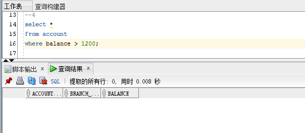

5. 查询所有存款额大于 1200 元的存款账户号，存款分行及存款人姓名。
```sql
select account_number, branch_name, customer_name
from depositor natural join account natural join account
where balance > 1200;
```
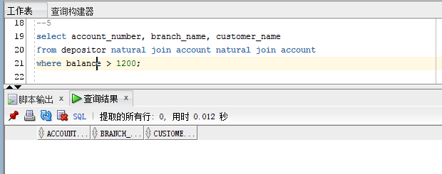

6. 查询所有姓名以’M’字母开头的用户的信息。
```sql
select *
from customer
where customer_name like 'M%';
```
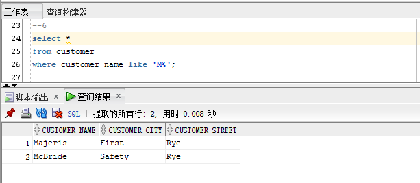

7. 查询所有居住街道名第二个字母为’a’的用户信息。
```sql
select *
from customer
where customer_street like '_a%';
```
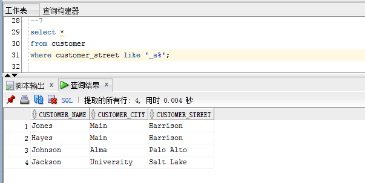

8. 查询借款额在 1000 到 2000 元的所有借款的信息。
```sql
select *
from loan
where amount >= 1000 and amount <= 2000;
```
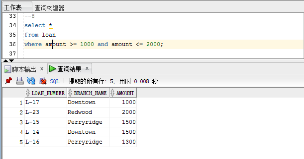

9. 查询所有借款的信息，包括借款人姓名，居住街道，居住城市，借款行，借款行所在城市，借款号，借款金额。
```sql
select customer_name, customer_street, customer_city,
       branch_name, branch_city, loan_number, amount
from borrower natural join customer natural join branch natural join loan;
```
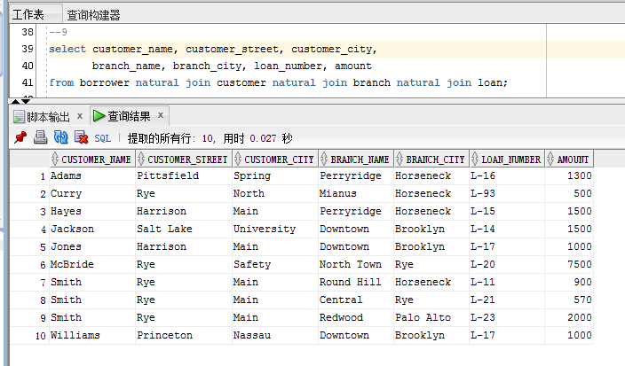

10. 查询所有存款的信息，包括存款人的姓名，居住的街道，居住城市，存款行，存款行所在城市，存款号，存款金额。
```sql
select customer_name, customer_street, customer_city,
       branch_name, branch_city, account_number, balance
from depositor natural join customer natural join branch natural join account;
```
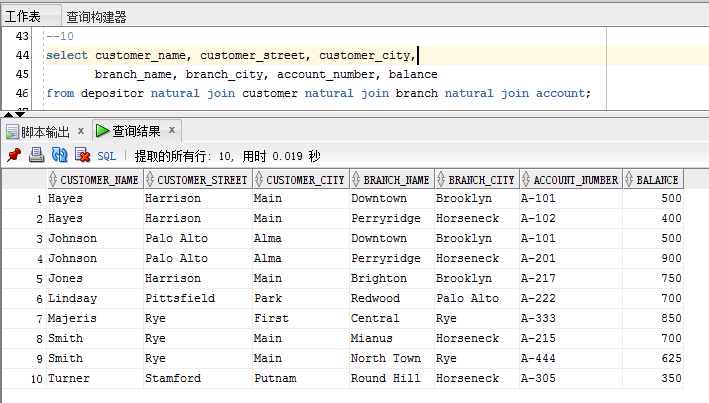

11. 查询所有顾客中向银行借了钱或存了钱的顾客姓名。
```sql
(select customer_name
from depositor)
union
(select customer_name
from borrower);
```
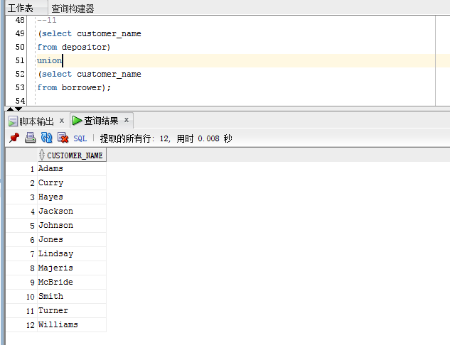

12. 查询所有顾客中存了钱，但没有借钱的顾客姓名。
```sql
select customer_name
from depositor
where customer_name not in (select customer_name
                       from borrower);
```
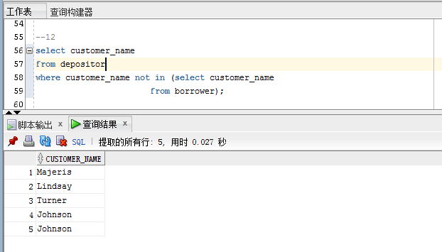

13. 查询所有顾客中即借了钱又存了钱的顾客姓名。
```sql
select customer_name
from depositor
where customer_name in (select customer_name
                        from borrower);
```
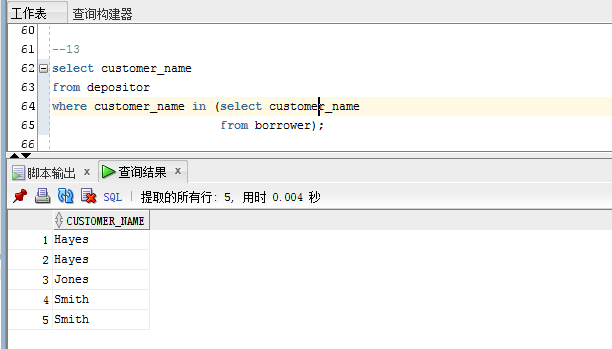

14. 建立一个视图，表示所有借款的信息，包括借款人姓名，居住街道，居住城市，借款行，借款行所在城市，借款号，借款金额。
```sql
create view borrow(customer_name, customer_street, customer_city,
                   branch_name, branch_city, loan_number, amount) as
select customer_name, customer_street, customer_city,
       branch_name, branch_city, loan_number, amount
from borrower natural join customer natural join branch natural join loan;
```
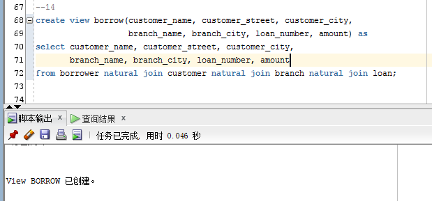

15. 建立一个视图，表示所有存款的信息，包括存款人姓名，居住街道，居住城市，存款行，存款行所在城市，存款号，存款金额。
```sql
create view deposit(customer_name, customer_street, customer_city,
                    branch_name, branch_city, account_number, balance) as
select customer_name, customer_street, customer_city,
       branch_name, branch_city,account_number, balance
from depositor natural join customer natural join branch natural join account;
```
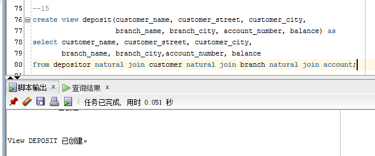

16. 建立一个视图，表示所有存借款的信息，包括类型（存款还是借款），顾客姓名，顾客居住街道，顾客居住城市，分行名称，分行所在城市，金额。
```sql
create view borrow_and_deposit(borrower_or_depositor, customer_name, customer_street,
                               customer_city, branch_name, branch_city, sum_of_money) as
(select 'borrower', customer_name, customer_street,
        customer_city,branch_name, branch_city, amount
from borrower natural join customer natural join branch natural join loan)
union
(select 'depositor', customer_name, customer_street,
        customer_city,branch_name, branch_city, balance
from depositor natural join customer natural join branch natural join account);
```
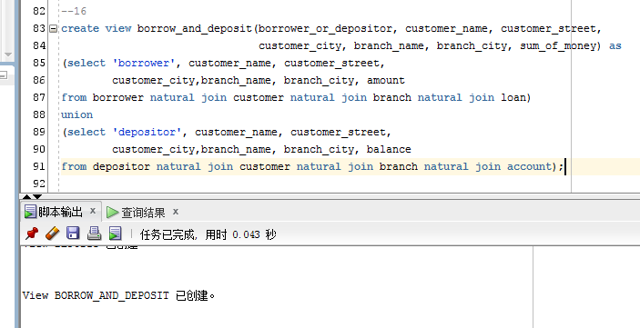

17. 查询存款金额最大的存款信息，包括存款人姓名，存款行，存款号，金额。
```sql
select customer_name, branch_name, account_number, balance
from depositor natural join account
where balance = (select max(balance)
                 from account);
```
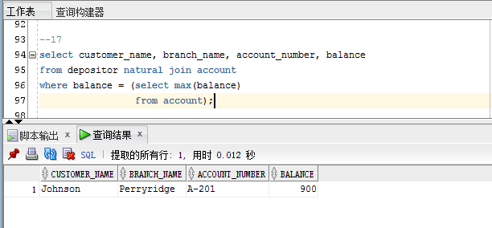

18. 查询所有顾客的存款信息，即使这个人没有存款。
```sql
select customer_name, account_number
from customer natural left outer join depositor;
```
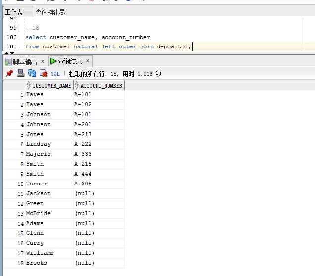

19. 查询所有存款信息，并按存款行升序，存款金额逆序，存款号升序的排序优先级显示结果。
```sql
select *
from depositor natural join account
order by account_number, balance desc;
```
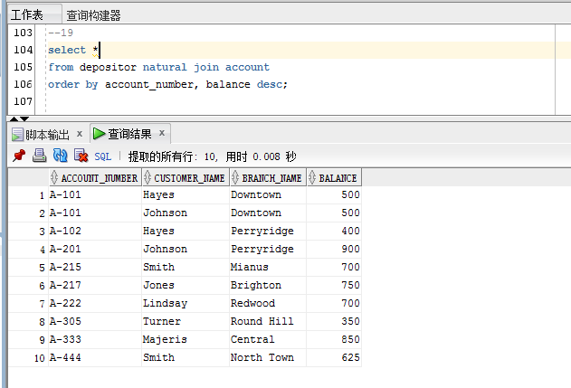

20. 查询’Downtown’分行的所有借款，包括借款号，借款人，借款金额，并按借款金额逆序排列显示结果。
```sql
select loan_number, customer_name, amount
from borrower natural join loan natural join branch
where branch_name = 'Downtown'
order by amount desc;
```
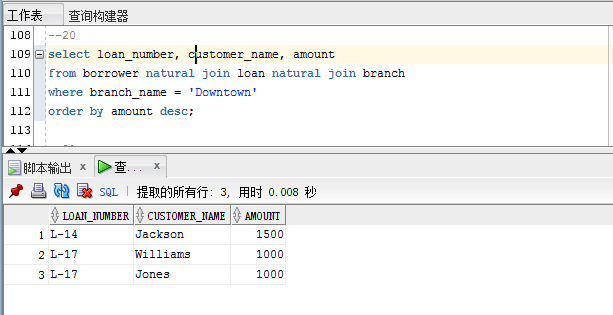

21. 建立一个表 t_branch,表结构与 branch 相同。（采用 create table tab_name as select 的方式）。
```sql
create table t_branch as(
    select *
    from branch
    where 1 = 0
);
```
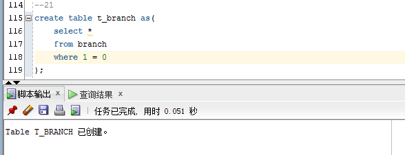

22. 将 branch 表中的数据插入 t_branch 表中。（采用 insert into tab_name select 的方式）。
```sql
insert into t_branch
    select *
    from branch;
```
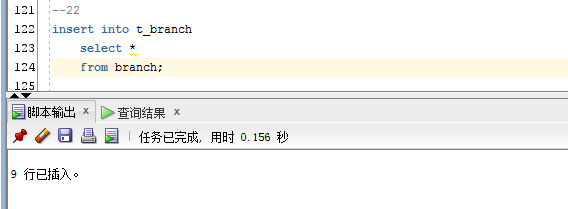