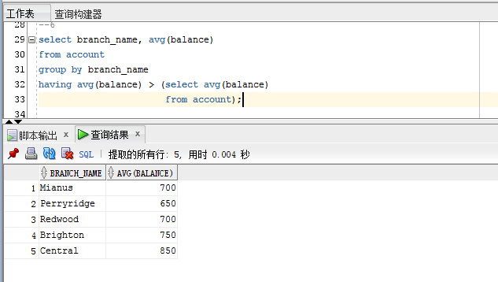

## 实验六（复杂查询）报告

### 实验目的  
1. 掌握聚类函数的使用
2. 掌握子查询的使用
3. 掌握 with 子句的使用
4. 掌握 Top-K 查询的写法
5. 掌握交叉表查询的写法

### 预备知识  
1. 常用聚类函数的使用语法。
2. in 子查询与 exists 子查询。
3. with 子句的语法。
4. decode 函数或 case 子句的语法。

### 实验内容  
1. 查询最大的存款金额。
```sql
select max(balance)
from account;
```


2. 查询各分行最大的存款金额。
```sql
select branch_name, max(balance)
from account
group by branch_name;
```


3. 查询各分行放贷金额总数，及放贷笔数，并按放贷金额总数降序排列。
```sql
select branch_name, sum(amount), count(loan_number), avg(amount)
from loan
group by branch_name
order by sum(amount) desc;
```


4. 查询平均单笔借款金额超过 750 元的所有分行的放贷金额总数，及放贷笔数，平均单笔放贷金额，并按放贷金额总数降序排列。
```sql
select branch_name, sum(amount), count(loan_number), avg(amount)
from loan
where amount > 750
group by branch_name
order by sum(amount);
```


5. 查询各分行的平均存款额。
```sql
select branch_name, avg(balance)
from account
group by branch_name;
```


6. 查询各分行存款额超过平均存款额的分行名，平均存款金额。
```sql
select branch_name, avg(balance)
from account
group by branch_name
having avg(balance) > (select avg(balance)
                       from account);
```


7. 使用 in 子句和 exists 子句分别查询，借了钱但是没有存钱的顾客姓名。
```sql
--in
select customer_name
from borrower
where customer_name not in (select customer_name
                            from depositor);
--exists
select customer_name
from borrower b
where not exists (select customer_name
                  from depositor d
                  where b.customer_name = d.customer_name);
```


8. 查询’Perryridge’， ’Brighton’， ’Downtown’分行存款信息，包括存款号，分行，金额，存款人姓名。
```sql
select account_number, branch_name, balance, customer_name
from account natural join depositor
where branch_name = 'Perryridge' or
      branch_name = 'Brighton' or
      branch_name = 'Downtown';
```


9. 查询在’Hayes’存钱的分行都存了钱的顾客姓名。
```sql
select distinct d.customer_name
from account a, depositor d, account a1, depositor d1
where a.account_number = d.account_number
  and a1.account_number = d1.account_number
  and a.branch_name = a1.branch_name
  and d1.customer_name = 'Hayes';
```


10. 查询存款额最多的前 3 位分行的名字。
```sql
select branch_name
from (select branch_name, rank() over(order by sum(balance) desc) as balance_rank
      from account
      group by branch_name)
where balance_rank <= 3;
```


11. 查询’Perryridge’， ’Brighton’， ’Downtown’这三家分行，所有顾客的存款金额。列名分别为顾客名，Perryridge 分行存款额， Brighton 分行存款额， Downtown 分行存款额。
```sql
select customer_name, sum(case when branch_name = 'Perryridge' then balance else 0 end) Perryridge,
                      sum(case when branch_name = 'Brighton' then balance else 0 end) Brighton,
                      sum(case when branch_name = 'Downtown' then balance else 0 end) Downtown
from account natural join depositor
group by customer_name;
```


### 比较 in 和 exists 区别  
1. exist,not exist一般都是与子查询一起使用， in可以与子查询一起使用,也可以直接in (a,b.....)
2. exist会针对子查询的表使用索引， not exist会对主子查询都会使用索引， in与子查询一起使用的时候,只能针对主查询使用索引. not in则不会使用任何索引