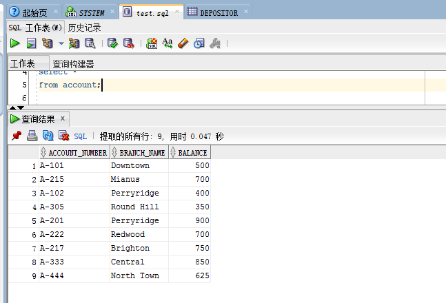
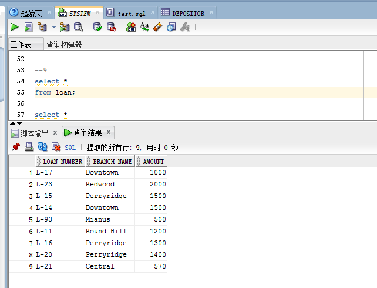

## 实验七（更新与删除）报告

### 实验目的  
1. 掌握更新操作
2. 掌握删除操作
3. 回滚和提交

### 预备知识  
1. update 语句的语法
2. delete 语句的语法
3. rollback 与 commit 的含义

### 实验内容  
1. 更新’L-11’号借款的金额为 1200 元。
```sql
update loan
set amount = 1200
where loan_number = 'L-11';
```

2. 更新’L-20’号借款的借款行为’Perryridge’，金额为 1400 元。
```sql
update loan
set branch_name = 'Perryridge', amount = 1400
where loan_number = 'L-20';
```

3. 给’Smith’的存款 6%的利息。
```sql
update account
set balance = balance * 1.06
where account_number in (select account_number
                        from depositor
                        where customer_name = 'Smith');
```

4. 给存款金额大于 2000 元的 6%的利息，小于等于 2000 元的 5%的利息。
```sql
update account
set balance = case when balance > 2000 then balance * 1.06
                   else balance * 1.05
              end;
```

5. 将’Smith’居住的城市更新为’Jones’居住的城市。
```sql
update customer
set customer_city = (select customer_city
                     from customer
                     where customer_name = 'Jones')
where customer_name = 'Smith';
```

6. 将’Smith’居住的城市，街道更新为’Turner’居住的城市和街道。
```sql
update customer
set customer_city = (select customer_city
                     from customer
                     where customer_name = 'Turner'),
    customer_street = (select customer_street
                       from customer
                       where customer_name = 'Turner')
where customer_name = 'Smith';
```

7. 删除用户’Brooks’;
```sql
delete from customer
where customer_name = 'Brooks';
```

8. 删除没有存款或借款的用户信息；
```sql
delete from customer
where customer_name not in ((select customer_name
                             from borrower)
                            union
                            (select customer_name
                             from depositor));
```

以下是1-8的运行结果  


9. 开启另外一个会话，连接到服务器。在原会话上和新会话上分别查看所有修改或删除过的表的结果。
```sql
select *
from loan;

select *
from account;

select *
from customer;
```
* account
  - 原会话
  
  - 新会话
  
* customer
  - 原会话
  
  - 新会话
  
* loan
  - 原会话
  
  - 新会话
  

10. 在原会话上的 Tab 中使用 rollback 回滚。
```sql
rollback;
```


11. 重复以上的每一步，在每一步以后 commit 结果；然后在两个会话中分别查看对应表的查询结果。

* account
  - 原会话
  
  - 新会话
  
* customer
  - 原会话
  
  - 新会话
  
* loan
  - 原会话
  
  - 新会话
  