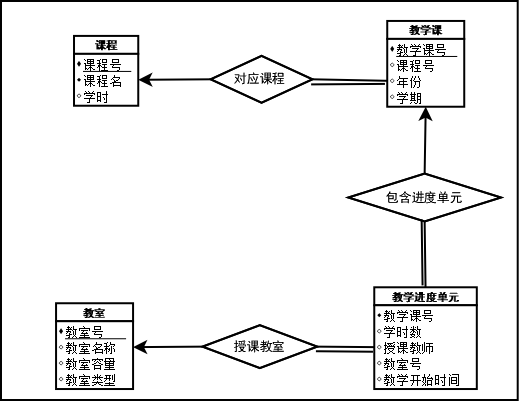

## 实验八（关系型数据库设计）报告

### 实验目的  
1. 掌握 E-R的画法
2. 掌握数据库设计的方法和要点
3. 理解和掌握范式理论对于数据库设计的要求

### 预备知识  
1. ER 模型及图元
2. ER 模型到关系型数据库转换规则
3. 范式理论中的检测与分解算法

### 实验内容  
1. 有下列数据需求，请画出这个数据库的 E-R 设计图。某大学的排课系统数据需求如下：  
a) 存在多个课程，课程包括课程号，课程名，学时。  
b) 每个课程可能会有 0 到多个教学课，每个教学课包括教学课号，年份，学期及其对应课程，一个教学课只能教授一门课程。  
c) 每个教学课对应有多个教学进度单元，每个单元包括这个单元的学时数，授课教师，授课的教室类型要求，具体安排的教室，具体安排的教学开始时间。  
d) 存在多个教室，教室包括教室号，教室名称，教室容量，教室类型。  

2. 根据你的 E-R 图，将其转换成数据库模型，并指出其符合第几范式的要求。  
> 加粗代替下划线  
> 课程(**课程号**, 课程名,  学时)  
> 教学课(**教学课号**, 课程号, 年份,  学期  
> &emsp;&emsp;foreign key 课程号 references 课程(课程号))   
> 教学进度单元(教学课号, 学时数, 授课教师, 教室号, 教学开始时间  
> &emsp;&emsp;foreign key 教学课号 references 教学课(教学课号)    
> &emsp;&emsp;foreign key 教室号 references 教室(教室号))    
> 教室(**教室号**, 教室名称, 教室容量, 教室类型)  

数据字典  
* 课程  

|属性|数据类型|主/外键|外键参照|
|-|-|-|-|
|课程号|varchar2(10)|PK||
|课程名|varchar2(20)|||
|学时|int|||

* 教学课  

|属性|数据类型|主/外键|外键参照|
|-|-|-|-|
|教学课号|varchar2(10)|PK||
|课程号|varchar2(10)|FK|课程(课程号)|
|年份|int|||
|学期|varchar2(10)||

* 教学进度单元  

|属性|数据类型|主/外键|外键参照|
|-|-|-|-|
|教学课号|varchar2(10)|FK|教学课(教学课号)|
|学时数|int|||
|教室号|varchar2(10)|FK|教室(教室号)|
|教学开始时间|varchaar2(20)||

* 教室  

|属性|数据类型|主/外键|外键参照|
|-|-|-|-|
|教室号|varchar2(10)|PK||
|教室名称|varchar2(10)|||
|教室容量|int|||
|教室类型|varchaar2(10)||

后面不会了。